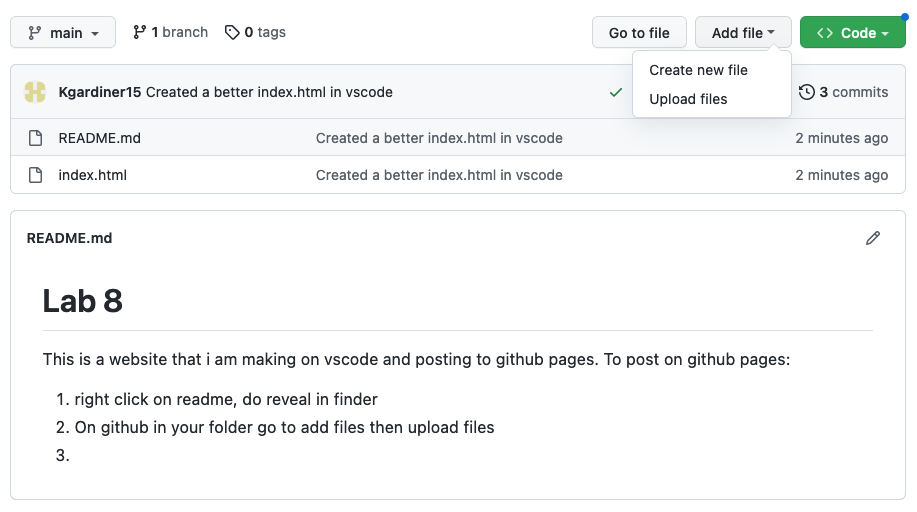

# Lab 8 

This is a website that i am making on vscode and posting to github pages. To post on github pages:

1. right click on readme, do reveal in finder 
2. On github in your folder go to add files then upload files 

